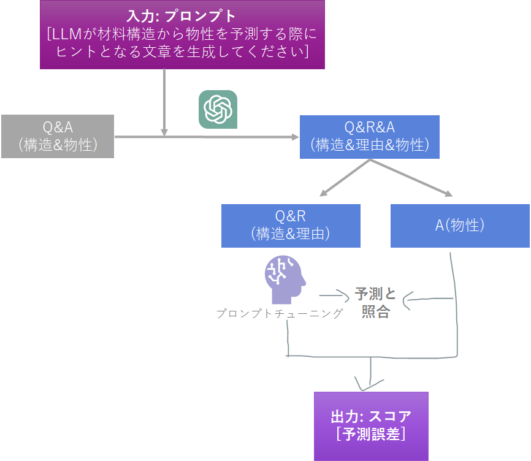
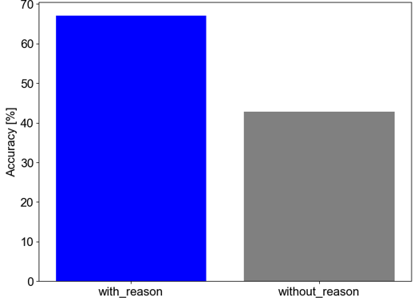
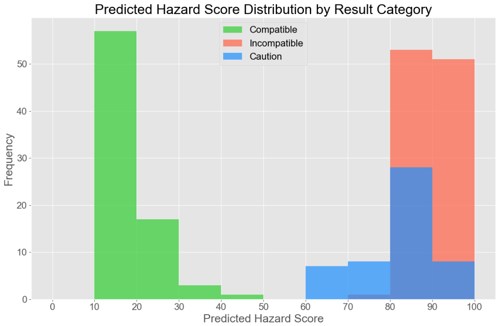
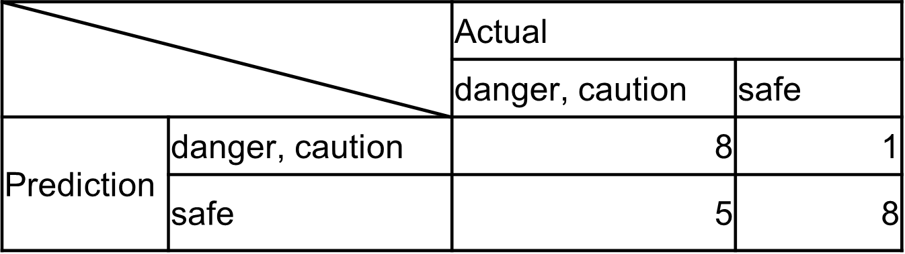

# ReactRiskRader - 2材料の組合せ(Q)－混合混触危険性(A)データセットから説明(Reason: R)を自動生成して､説明付きで予測するツール

# 情報
- 2023/12/16
- kan hatakeyama
- 2024/2/14
- Masaki Open Lab.

# アイデア
- [こちらの記事を参照](https://note.com/kan_hatakeyama/n/n56afe0df282a)
- 
- ※上記をベースに、混合混触危険性予測に対応したスクリプトに書き換えを行いました。また、CRWに格納されたreferenceをReasonの生成に用いる、というアイデアを追加いたしました（種々検討の結果、その方が予測精度に優れることが分かったため）。

# 使い方
- api_key.pyを作成し､openaiのapiキーを設定(api_key ="***" )
- [QTA_gen_practice.ipynb](QRA_gen_practice.ipynb)を実行
- [Analyze_gen.ipynb](Analyze_gen.ipynb)で解析

# 結果①：Reasonの効果
- 条件
  - ランダムに選択した数十物質の組合せで比較
  - GPT3.5で理由生成&回答
  - ランダム性を考慮して､予測は独立に3回

- "Reason"の有無が予測精度に及ぼす影響
  - Reasonを生成し予測に用いることにより、精度が向上
  - 
  - 危険度を100点満点のhazard scoreに変換した結果、50点を閾値にCompatibleとCaution, Incompatibleが分離可能
  - 

# 考察①
  - 上記の結果は､ある種の訓練データになってしまっている点に注意
  - 最終目的は､このような自動生成されたデータセットを使ってモデルをファインチューニングし､未知分子について､Qのみから､RとAを生成すること

# 結果②：llama 2のファインチューニングによる未知物質の組合せに対する混合混触危険性予測
  - Google colabにてloraを実施（学習データ ~ 1200件）
  - 22件の組合せをテストデータとして、予測を行った
  - Accuracy = 72%、llama 2は混合混触危険性データセットを学習したものと推察
  - 

# TODO
  - プロンプトチューニング
  - 学習データの拡張
  - より優れた性能が期待される公知LLMの使用
# Issue
  - GPT3.5による理由生成に失敗する例あり